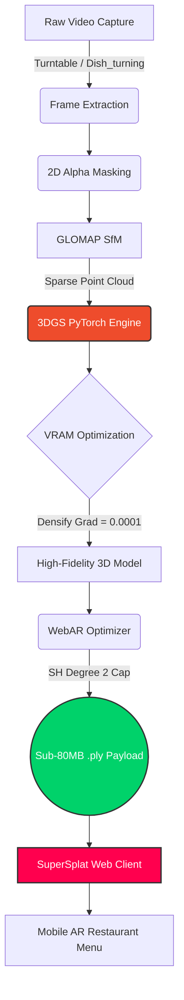

<div align="center">


# 🍔 WebAR Menu Pipeline (3D Gaussian Splatting)

[](https://python.org)
[](https://pytorch.org/)
[](https://github.com/colmap/glomap)
[](https://playcanvas.com/supersplat/editor)
[]()

*A highly optimized, end-to-end 3D Gaussian Splatting pipeline designed specifically for capturing hyper-realistic food dishes and compressing them for WebAR mobile browsers—built for consumer hardware (8GB VRAM).*

</div>

---

## 📖 Overview

The **WebAR Menu Pipeline** is an academic research project and full production codebase that translates raw video of food dishes into interactive, 60-FPS WebAR experiences. Standard 3DGS produces massive ~1.5 GB `.ply` files that crush mobile browsers. This pipeline implements custom **Spherical Harmonics Reduction**, **Spatial Bounding Boxes**, and **Alpha Masking** to compress photorealistic models below **80 MB**, allowing seamless integration into digital restaurant menus.

---

## 🏗️ Architecture & Phases

The repository is modularly structured into three distinct phases of the production pipeline.

### Phase 1: Capture & Structure-from-Motion (SfM)
> 📁 **`Phase_1_Capture_and_SfM`**

The preprocessing phase translates raw video captures into mathematically structured data.
- **Automated Frame Extraction:** Extracts crystal-clear, unblurred frames from turntable captures.
- **Background Deletion:** Implements `rembg` (U2Net) to create 2D Alpha Masks, allowing the rasterizer to natively ignore background noise.
- **GLOMAP Engine:** Uses Global Structure-from-Motion (SfM) to solve camera extrinsics drastically faster than traditional COLMAP.

### Phase 2: 3DGS Training Engine
> 📁 **`Phase_2_3DGS_Training`**

The core PyTorch engine, heavily modified from the original Inria implementation to prevent hardware bottlenecks.
- **3D Spatial Bounding Boxes:** A custom PyTorch injection (`train_glomap.py`) that calculates Euclidean distances during densification to instantly delete point clouds that drift outside the target radius.
- **VRAM Optimization:** Bypasses "Hedgehog Overfitting" anomalies to keep training well within the 8 GB limit of consumer GPUs.
- **WebAR Compressor:** The `optimize_webar.py` script automatically strips non-essential Spherical Harmonics (preserving Degree 2 for glossy reflections), slicing payload sizes by up to 50% without visual degradation.

### Phase 3: WebAR Client
> 📁 **`Phase_3_WebAR_Client`**

The frontend deployment phase. This folder is reserved for the integration team to deploy PlayCanvas/SuperSplat `.html` templates that parse the optimized `.ply` files onto mobile browsers.

---

## 🧬 Pipeline Workflow

The entire logic flows sequentially as mapped out below:



---

## 🔬 Academic Documentation

This codebase is accompanied by rigorous academic documentation detailing the mathematical constraints and physical experiments performed.

> 📚 **Read the full Thesis Document:** [`Docs/project_doc.md`](Docs/project_doc.md)

**Key Discoveries Documented:**
*   **The Bounding Box Paradox:** Mathematical proof of why `Me_walking` (dynamic camera) capture strategies fail under 3D bounding box isolation due to PyTorch L1 Loss function panic.
*   **The Hedgehog Anomaly:** Documentation on how aggressive Densification Gradients destroy geometry on consumer hardware.
*   **Turntable Superiority:** Physical validation of the `Dish_turning` method as an organic, natural spatial isolator.

---

## 🚀 Quick Start

To run the production training pipeline on a newly preprocessed dish:

```bash
# 1. Activate the Conda Environment
conda activate gaussian_splatting

# 2. Navigate to Phase 2
cd Phase_2_3DGS_Training

# 3. Execute the Automated WebAR Pipeline
.\train_glomap_v2.bat
```

*The script will automatically train the model for 30,000 iterations, run the WebAR compression logic, and output a `point_cloud_web.ply` ready for web deployment.*

---

<div align="center">
<i>Built for the future of interactive dining.</i>
</div>
